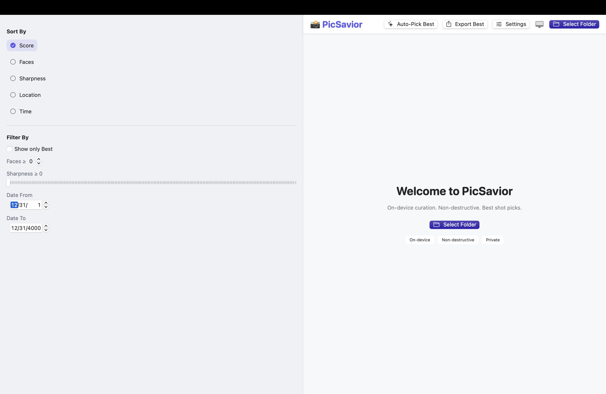
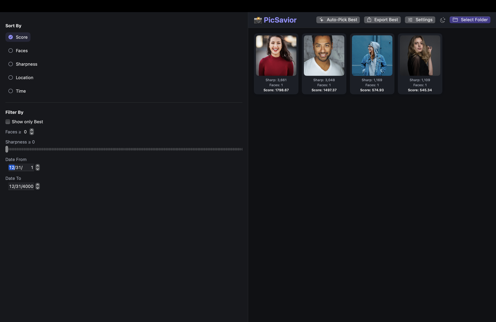

# Equity Forecasting Engine – Time-Series Prediction Dashboard
*(Streamlit · Prophet · yfinance · Plotly · Pandas)*

## Overview
A Streamlit dashboard that forecasts equity prices using **Prophet** on OHLCV data from **yfinance**, with interactive charts, confidence bands, and configurable horizons.

## Links
- **GitHub repo:** <PASTE YOUR EQUITY REPO URL HERE>
- **Live app (Streamlit Cloud):** <PASTE YOUR STREAMLIT APP URL HERE>

## Key Features
- End-to-end forecasting workflow with Prophet  
- Interactive Plotly visuals (history, forecast, components)  
- Robust preprocessing for clean `ds`/`y` frames  
- Caching for snappy interaction; look-ahead up to 4 years

## Screenshots

